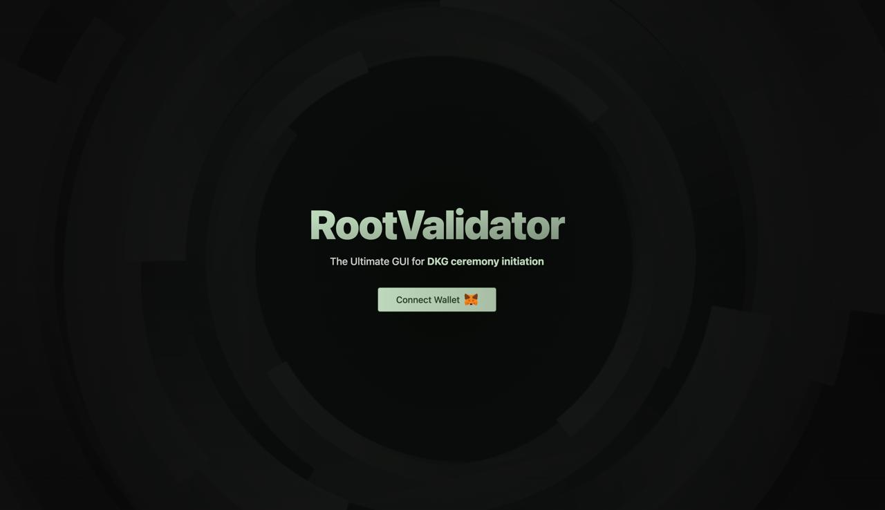
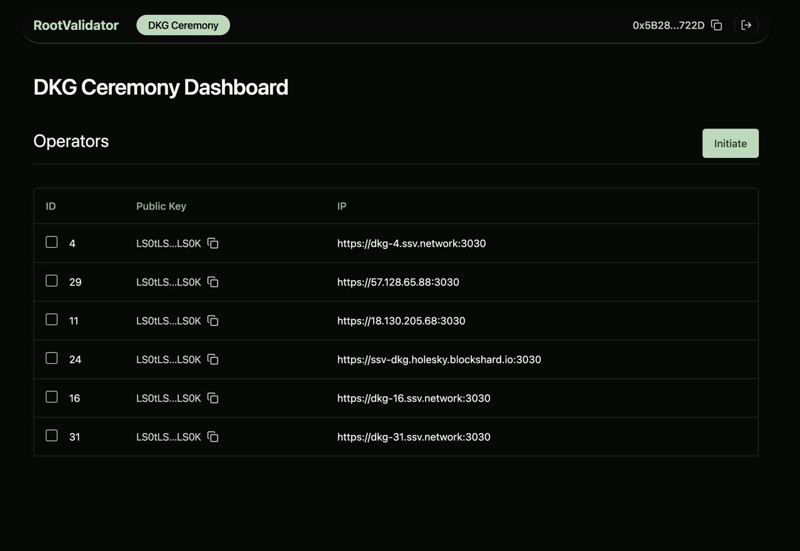
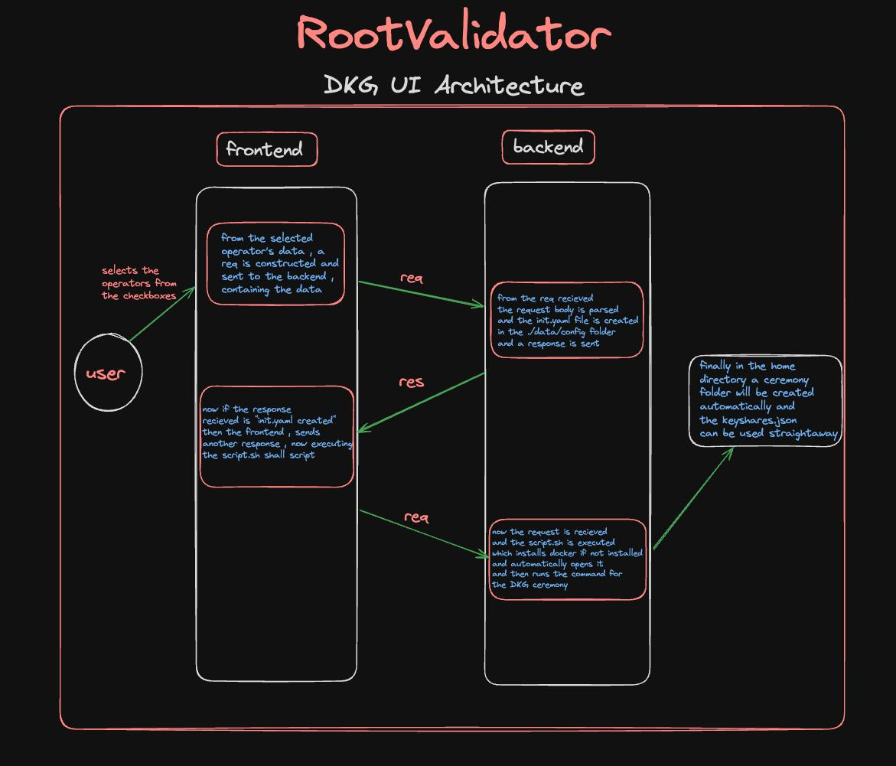
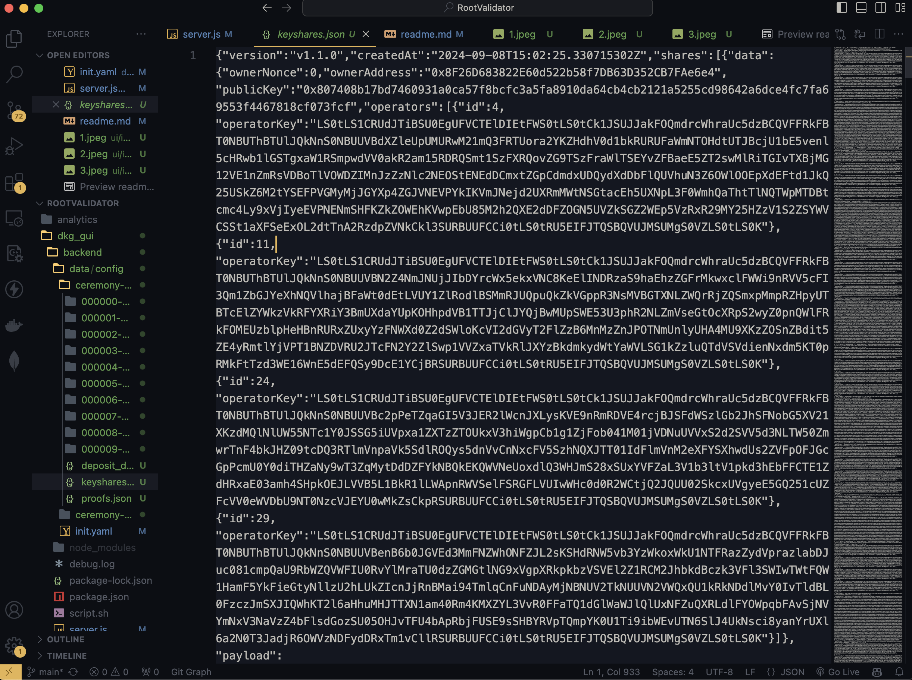

# RootValidator

**RootValidator** is an innovative platform designed to streamline the management and initiation of Distributed Key Generation (DKG) ceremonies for the SSV Network, while also offering an analytics dashboard to provide comprehensive insights into user accounts and operations within the network.

## Features

### DKG Ceremony Initiation GUI
- **User-Friendly Interface**: Designed to simplify the complex process of initiating a DKG ceremony through an intuitive and accessible graphical user interface (GUI).
- **Key Generation Made Simple**: Automatically handles key share generation and management, requiring minimal user intervention while ensuring security and accuracy.
- **Operator Management**: Allows users to easily connect their wallets, select operator IDs, and automatically generate the required key share and deposit files, hiding the backend complexities of the process.

## Benefits

- **Enhanced Usability**: Lowers the technical barrier for users by simplifying DKG ceremony initiation, making it accessible even for those with minimal technical knowledge.
- **Optimized Decision-Making**: Informs users with real-time data and insights to help them optimize their interactions and participation in the SSV Network.
- **Efficient Operations**: Automates key generation and other complex tasks, allowing users to focus on higher-level operations.

## Uses

RootValidator is specifically designed to help users, especially non-technical ones, participate in the SSV Network's Distributed Key Generation (DKG) process without needing deep technical expertise or prior knowledge of Docker. 

- **Non-Tech Friendly**: If you're unfamiliar with Docker or don't have it installed, RootValidator handles everything for you. The platform detects whether Docker is installed on your machine, and if not, it automatically installs Docker in the background, ensuring a smooth experience.
  
- **DKG Ceremony Simplification**: Instead of manually handling scripts and commands, you can initiate the DKG ceremony with just a few clicks. The platform will handle all technical aspects such as running Docker containers, managing configurations, and generating the necessary key share files.

## Code Overview

### Server Code

RootValidator's server is built using Express.js and interacts with a local environment to manage DKG initiation and configuration generation. The core components of the server are described below:

- **`app.get('/')`**: This endpoint is triggered when a user navigates to the root URL (`/`). It runs the `run_script()` function, which executes a shell script (`script.sh`). This script checks if Docker is installed on the machine. If Docker is missing, the script installs it automatically, ensuring a seamless setup process. It then initiates the SSV DKG Docker container to start the DKG ceremony.

- **`app.post('/create_config')`**: This endpoint is called when configuration data for the DKG ceremony is submitted. The server receives the configuration data from the request body and invokes the `configyamlfile(config)` function to generate a YAML configuration file (`init.yaml`). This file contains important information such as validator IDs, operator IDs, and network settings, which are used to initialize the DKG process within the Docker container.

#### Functions

- **`run_script()`**: This function is responsible for running the shell script (`script.sh`). It uses Node.js's `exec` and `spawn` methods to handle script execution and logs the results to the console. If Docker is not installed, it triggers the installation process and, once installed, it runs the Docker container with the appropriate configuration for the DKG ceremony.

- **`configyamlfile(config)`**: This function generates the configuration file (`init.yaml`) based on the data provided in the request. The YAML file includes details such as validator information, operator IDs, and network settings. The function ensures that the configuration file is properly formatted and saved in the appropriate directory (`data/config`). Once the file is created, the DKG ceremony can proceed using this configuration.

### Docker Installation Script

**`script.sh`** handles the Docker installation and the execution of the SSV DKG Docker container. The script has the following key components:

- **`install_docker_Linux()`**: This function installs Docker on Linux systems. It updates the package lists, installs required dependencies, and sets up Docker from the official Docker repository. It also ensures that Docker starts automatically.

- **`install_docker_mac()`**: This function installs Docker on macOS using Homebrew. It checks if Homebrew is installed and then uses it to install Docker for macOS users.

- **Docker Check and Execution**: The script checks if Docker is installed. If Docker is already present, it proceeds to run the SSV DKG Docker container. If Docker is missing, it installs Docker based on the user’s operating system (Linux or macOS). After verifying Docker installation, the script runs the Docker container using the provided configuration files, enabling the DKG process.

## Future Development

In future releases, RootValidator will also provide **comprehensive analytics** through its dashboard:

- **Account Insights**: Users will be able to view real-time analytics about their participation in the SSV Network. This will include information about key shares, operator performance, and ceremony success rates.
  
- **Operator Performance**: The dashboard will provide a detailed overview of operator activities, including uptime and reliability metrics. This will help users make informed decisions about operator selection and management.

- **Network Health Monitoring**: Users will have access to network-wide insights, including network health and DKG ceremony success rates, enabling proactive decisions and optimizations.

These analytics features will empower users with more control and visibility over their interactions within the SSV Network.

